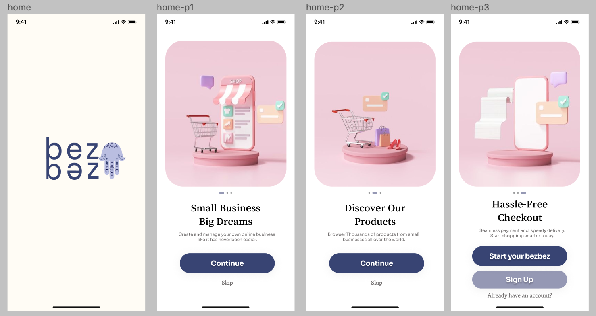
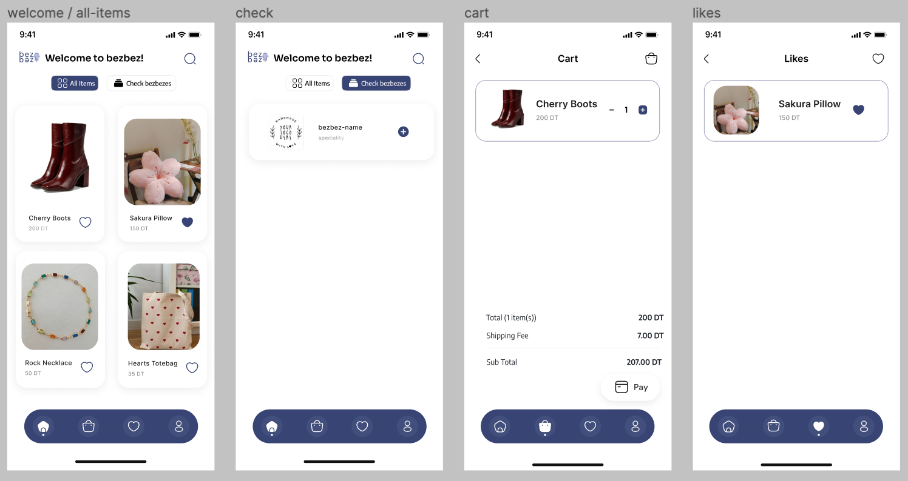
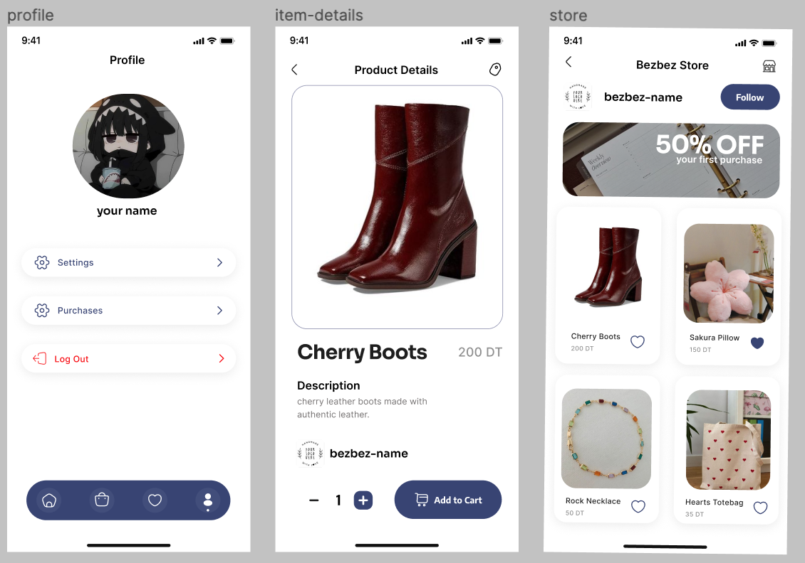
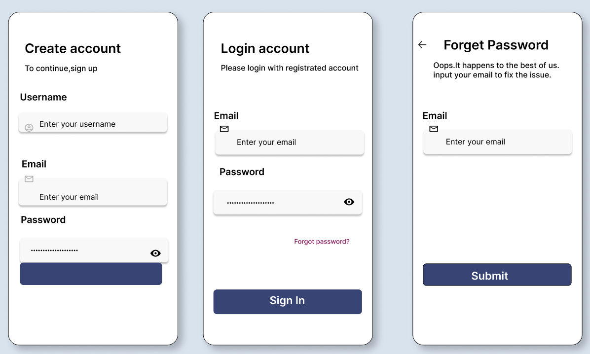
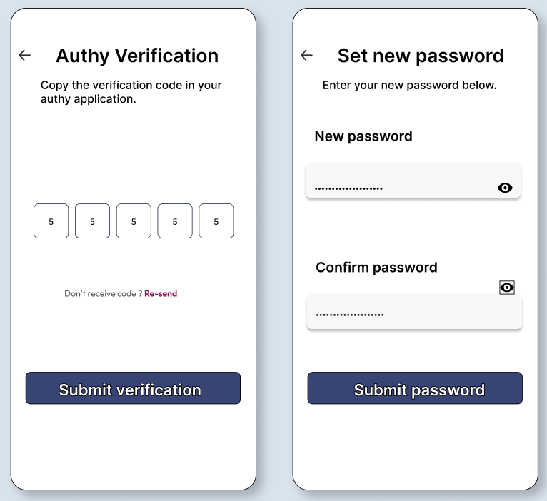
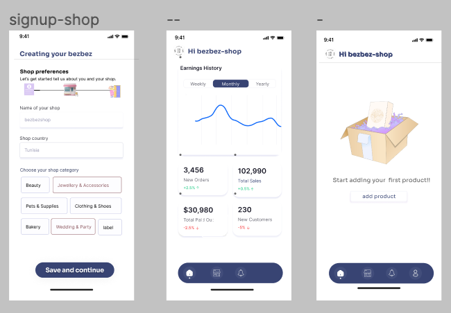

# Bezbez for small business

## Figma interfaces

## Getting Started

1. **frontend**

- Clone the Repository : `$ git clone https://github.com/hadily/bezbez-app.git``
- Navigate to Client Directory : `$ cd client``
- Install Dependencies : `$ npm install``
- Start the ionic server : `$ ionic serve`

2. **Backend**

2.1 **Setting up the Virtual Environment:**
// The virtual enviroment is set for depedencies and versions of the project to be isolated from the rest //

   - Change directory to the server folder: `$ cd server`
   - Install virtualenv if not already installed: `$ pip install virtualenv`
   - Create a virtual environment  ` $ virtualenv venv`
   - Activate the virtual environment: `$ source venv/Scripts/activate`
   - Installing requirements.txt : `$ pip install -r requirements.txt`
   - create a `.gitignore ` file under `BEZBEZ-APP` and include in the `.gitignore` the `venv`  folder

   - From now on any modification on the server should be done after activating the venv

2.2 **Setting up the PostgreSQL  server:**
   - Access  Pgadmin
   - Create database `bezbez`
   - set the credentials data in settings.py 

2.3 **Back to the Django Project:**
   - After configuring postgreSQL, return to your Django project directory.
   - Run Django's `$ python manage.py makemigrations` command to create migrations based on the changes you've made to your models.
   - Apply the migrations to the database using `$ python manage.py migrate`.
   - Finally, start the Django development server with `$ python manage.py runserver`.

